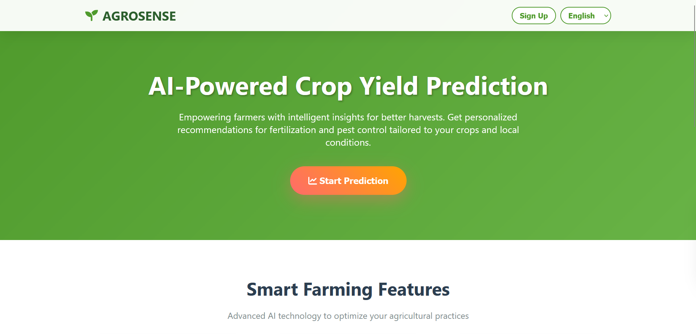

<h1 align="center">
  
  AgroSense
</h1>

<p align="center">
  
</p>

<p align="center">
  <em>AI-powered Smart Farming Platform for Crop Yield, Soil Health, Pest Control, and Irrigation Management</em>
</p>

<p align="center">
  <a href="https://github.com/Busted-pinch/AgroSense">
    
  </a>
  <a href="https://github.com/Busted-pinch/AgroSense/actions/workflows">
    
  </a>
  
  
</p>

---

## 🌾 Overview

AgroSense is a comprehensive agricultural application aimed at improving crop yield, soil health, pest control, and irrigation management through **Machine Learning**, **Deep Learning**, and **Predictive Analytics**. The project provides **real-time advisory and actionable insights** to farmers using AI-powered features.

---

## ✨ Features

| Feature | Description |
|---------|-------------|
| 🧑‍🌾 **Expert Consultation** | Connect with farming experts for guidance and personalized advice. |
| 💧 **Smart Irrigation** | Optimize water usage based on environmental data for better yield. |
| 🌱 **Soil Health Monitoring** | Analyze and improve soil conditions using AI insights. |
| 🐛 **Pest Control Management** | Identify and manage pest threats using machine learning models. |
| 📈 **Market Insights** | Get market trends, pricing suggestions, and recommendations. |
| 🎤 **Voice Input Support** | Interact with the system using voice commands for hands-free operation. |

---

## 🛠 Technologies Used

- 🐍 **Python** – FastAPI for backend  
- 🌐 **Frontend** – HTML, CSS, JavaScript  
- 🤖 **Machine Learning** – Models stored as `.pkl` files  
- 💾 **Database** – SQLite  
- 📦 **Libraries** – Refer to `requirements.txt` for full list  

---

## ⚙️ Installation

1. **Clone the repository:**
   ```bash
   git clone https://github.com/Busted-pinch/AgroSense.git
   cd AgroSense
2.**Create and activate a virtual environment:**

   ```bash
  python -m venv venv
  venv\Scripts\activate      # Windows
  source venv/bin/activate   # macOS/Linu
   ```
3.**Install dependencies:**

 ```bash
pip install -r requirements.txt
 ```
4.**Configure environment files:**
- Ensure .env files are placed in the correct directories.

5.**Run the application:**

 ```bash
  python app/main.py
 ```

🤝 Contributing
Contributions are welcome!
Please fork the repository and submit a pull request with your improvements.

📌 Notes
- Large model files like .pkl are managed via Git LFS.

- For any additional data files or models (e.g., Yield_model.pkl), download separately as mentioned in the repository instructions.
